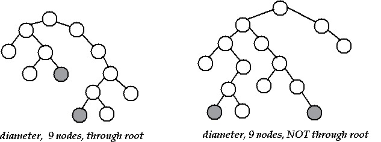
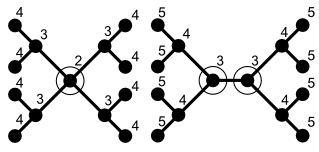

# Binary Tree Diameter and Center

## Diameter/Width

* #nodes on the longest path between two leaves in the tree
* length of longest path
* Note that diameter need not include root



## Center

* a vertex `v` such that longest path from `v` to a leaf is minimal over all vertices
* median of diameter gives center
* a tree can have at most 2 centers



---

Diameter of tree is max of following:
* diameter of left subtree
* diameter of right subtree
* longest path between leaves through root

```java
int diameter(Node node) {
    if(node==null)
        return 0;

    return max(
        diameter(node.left),
        diameter(node.right),
        height(node.left)+1+height(node.right)
    );
}

int height(Node node) {
    if(node==null)
        return 0;
    return 1+max(height(node.left), height(node.right);
}
```

running time: `$O(n^2)$`

### Optimization

compute hight of node during recursion rather than calling `height()` separately

```java
(int diameter, int height) diameter(Node node){
    if(node==null)
        return {0, 0};

    Tuple left = diameter(node.left);
    Tuple right = diameter(node.right)
    int diameter = max(
        left.diameter,
        right.diameter,
        left.height+1+right.height
    );
    int height = max(left.height, right.height)+1;

    return (diameter, height);
}
```

Running Time: `$O(n)$`

---

### Another Approach

* pick any vertex `r` (say root)
* find vertex `v1` that is farthest from `r`
* find vertex `v2` that is farthest from `v1`

diameter = length of path from `v1` to `v2`  
center = median elements of path from `v1` to `v2`

Running Time: `$O(n)$`

---

### References

* <http://www.cs.duke.edu/courses/spring00/cps100/assign/trees/diameter.html>
* <http://www.geeksforgeeks.org/?p=5687>
* <http://wwwmayr.in.tum.de/konferenzen/Jass08/courses/1/smal/Smal_Paper.pdf>
