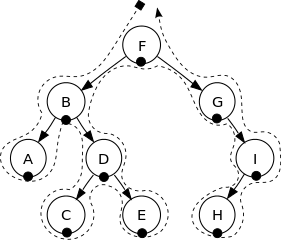

# Binary Tree Traveral

while doing depth-first traversal:

### Pre-Order


when you are about to visit left child, append it to preorder  
F, B, A, D, C, E, G, I, H

### In-Order



when you are about to visit right child, append its parent to inorder  
A, B, C, D, E, F, G, H, I

### Post-Order


when visiting of a node's subtree finished, append to postorder  
A, C, E, D, B, H, I, G, F

```java
void dfs(Node n, List preorder, List inorder, List postorder) {
    Stack path;
    path.push(n);

    while(true) {
        n = path.peek();
        preorder.add(n);
        if(n.left!=null) {
            path.push(n.left);
        } else {
            inorder.add(n);
            if(n.right!=null)
                path.push(n.right);
            else {
                while(true) {
                    n = path.pop();
                    postorder.add(n);
                    if(path.isEmpty())
                        return;
                    else if(path.peek().left==n) {
                        inorder.add(path.peek());
                        if(path.peek().right!=null) {
                            path.push(path.peek().right);
                            break;
                        }
                    }
                }
            }
        }
    }
}
```

### Pure Iterator

```java
final int VISIT_LEFT     = 0;
final int VISIT_RIGHT    = 1;
final int VISIT_FINISHED = 2;

void dfs(Node n, List preorder, List inorder, List postorder) {
    Stack path;
    path.push(n);

    List lists[] = { preorder, inorder, postorder };
    int action = VISIT_LEFT; // tells the action to be taken an path.peek()
    while(true){
        n = path.peek();
        lists[action].add(n);
		switch(action) {
        case VISIT_LEFT:
            if(n.left!=null)
                path.push(n.left);
            else
                action = VISIT_RIGHT
            break;
        case VISIT_RIGHT:
            if(n.right!=null){
                path.push(n.right);
                action = VISIT_LEFT;
            }else
                action = VISIT_FINISHED
            break
        case VISIT_FINISHED: 
            path.pop();
            if(path.isEmpty())
                break;
            if(path.peek().left==n)
                action = VISIT_RIGHT;
        }
    }
}
```
