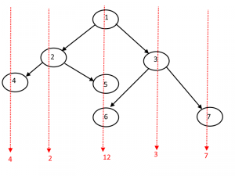

# Vertical Sum

Given a Binary Tree, find vertical sum of the nodes that are in same vertical line. Print all sums through different vertical lines



---

calculate Horizontal Distance(HD) for each node:
* HD(root) = 0
* HD(n.left) = HD(n) - 1
* HD(n.right) = HD(n) + 1

if two nodes have same HD, then they are on same vertical line.  
so simply sum the nodes with same HD

since we don't know "how many vertical lines exist", use doubly linked list

```java
int[] verticalSum(Node n) {
    if(n==null)
        return new int[0];

    ListNode head = new ListNode(0);
    head = verticalSum(n, head, head);

    int result[size(head)];
    int i=0;
    while(head!=null) {
        result[i] = head.data;
        head = head.next;
        i++;
    }
    return result;
}

ListNode verticalSum(Node n, ListNode cur, ListNode head) {
    cur.data += n.data;
    if(n.left!=null) {
        if(cur.prev==null) {
            ListNode t = new ListNode(0);
            t.next = cur;
            cur.prev = t;
            head = t;
        }
        head = verticalNode(n.left, cur.prev, head);
    }
    if(n.right!=null) {
        if(cur.next==null) {
            ListNode t = new ListNode(0);
            cur.next = t;
            t.prev = cur;
        }
        head = verticalSum(n.right, cur.next, head);
    }
    return head;
}
```

---

### References

* <http://www.geeksforgeeks.org/vertical-sum-in-a-given-binary-tree/>
