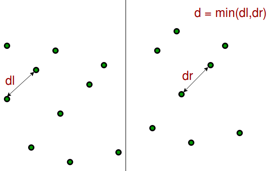
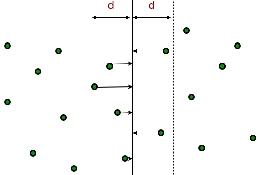

# Closest Pair of Points

Given `n` points, find a pair of points with the smallest distance between them ?

---

### Brute-Force

~~~java
float closest(Points p[]) {
	d = infinity;
	for i=0 to len(p)-2 {
		for j=i+1 to len(p)-1 {
			if dist(p[i], p[j]) < d {
				d = dist(p[i], p[j])
			}
		}
	}
	return d;
}
~~~

Running Time: $O(n^2)$

---

1. sort input array by `x` coordinate
2. consider a vertical line at `p[n/2]` splitting input into two halves
    - first half contains `p[0]` to `p[n/2]`
    - second half contains `p[n/2+1]` to `p[n-1]`
3. recursively find smallest distances in both halves, say `dL` and `dR`
4. find the smallest distance among the pairs in which on point lies in first half and another lies in second half, say `dLR`
5. answer is `min(dL, dR, dLR)`

step 4 can be done optimally as below:
- consider `d = min(dL, dR)`
- consider all points that are closer than `d` to the middle vertical line
- sort those points by their `y` coordinate
- find the `dLR` by considering pairs whose `y` distance is less than `d`

~~~java
Pair closest(Point p[]){
	sort(p, (p1, p2) -> p1.x-p2.x);
	return closestPair(p, 0, len(p)-1);
}

Pair closest(Point p[], int lo, int hi){
	if hi-lo+1<=3 {
		return bruteForce(p);
	}
	mid = len(p)/2;
	dl = closest(p, lo, mid);
	dr = closest(p, mid+1, hi);
	d = min(dl, dr);
	
	Point[] strip;
	for i=lo; i<=hi; i++ {
		if abs(p[i].x-p[mid].x)<d {
			strip.append(p[i])
		}
	}
	sort(strip, (p1, p2) -> p1.y-p2.y);
	
	dlr = d
	for i=0 to len(strip)-2 {
		for j=i+1 to len(strip)-1  {  // line 26
			if strip[j].y-strip[i].y>=d {
				break;
			}
			if dist(strip[i], strip[j]) < dlr {
				dlr = dist(strip[i], string[j]);
			}
		}
	}
	
	return dlr;
}
~~~

loop at `line 26` is executed at most `7` times. why ?

* consider a square of size `d/2` on either side
* maximum distance pair possible in this square is along diagnal
* distance of such pair is $d/\sqrt 2$ which is less than `d`
* since there are no pairs with less than `d` on either side, we can conclude that such square contains at most one point
* inside stripe, from any point within `d` distance downward, we can draw `8` such squares
* so the loop is executed at most `7` times (excluding self)

Running Time: $O(n \log_2 n)$

---

### References

* <https://www.geeksforgeeks.org/closest-pair-of-points-using-divide-and-conquer-algorithm/>
* <http://people.csail.mit.edu/indyk/6.838-old/handouts/lec17.pdf>
