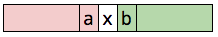
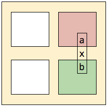

# Find Peak

## in Array (1D)

Given array `A[n]`, an element is peak if it is not smaller than its neighbors.  
neighbors of `A[i]` are `A[i-1], A[i+1]`  
i.e each element has at most 2 neighbors  
i.e first and last element has only one neighbor

Example: {10, **13**, 5, **8**, 3, 2, 1} has two peaks

**claim:** an array contains at least one peak  
max element in array is not smaller than its neighbors, hence proved

### Naive Implementation

check each element for peak

```java
int findPeak(int a[]) {
    for(int i=0; i<a.length; i++) {
        if((i==0 || a[i]>=a[i-1]) && (i==a.length-1 || a[i]>=a[i+1])
            return i;
    }
    assert false: "should not reach here";
}
```

Running Time: `$O(n)$`

### Divide & Conquer



* `x` is middle element. `a` and `b` are its neighbors
* if `a>x`:
    * repeat the steps in red subarray
* else if `b>x`:
    * repeat the steps in green subarray
* else `x` is a peak

**claim 1:** if `a>x` then red subarray contains a peak of `A`
* if `a` is max in red subarray:
    * then `a` is not smaller than its left neighbor
    * since `a>x`, `a` is not smaller than its right neighbor
    * hence `a` is peak of `A`
* if max is something other than `a`:
    * it must also be peak of `A`

**claim 2:** if `a>x` then any peak in red subarray is indeed peak of `A`
* if `a` is peak of subarray:
    * then `a` is not smaller than its left neighbor
    * since `a>x`, `a` is not smaller than its right neighbor
    * hence `a` is indeed peak of `A`
* if peak is something other than `a`:
    * it must also be peak of `A`

```java
int findPeak(int a[]) {
    int i=0, j=a.length-1;
    while(true) {
        int m = i+(j-i)/2;
        if(m-1>=i && a[m-1]>a[m])
            j = m-1;
        else if(m+1<=j && a[m+1]>a[m])
            i = m+1;
        else
            return m;
    }
}
```

`$T(n) = T({n \over 2}) + O(1) = O(\log_2 n)$`

---

## in Matrix (2D)

Given array `A[m][n]`, an element is peak if it is not smaller than its neighbors.  
neighbors of `A[i][j]` are `A[i-1][j], A[i+1][j], A[i][j-1], A[i][j+1]`  
i.e. each element has at most 4 neighbors

`$\begin{pmatrix}
10 &  8 & 5 \\
 3 &  \color{blue}2 & 1 \\
 \color{blue}7 & \color{red}{13} & \color{blue}4 \\
 6 &  \color{blue}8 & 3 \\
\end{pmatrix}$` here `13` is a peak

### Approach 1

construct `B[n]`, where `B[i]` is max of `i`<sup>th</sup> column of `A`

`$A = \begin{pmatrix}
\color{red}{10} &  8 & \color{red}5 \\
 3 &  2 & 1 \\
 7 & \color{red}{13} & 4 \\
 6 &  8 & 3 \\
\end{pmatrix} 
\text{ }B = \begin{pmatrix}
10 & 13 & 5 \\
\end{pmatrix}$`

then peak of `B` is also peak of `A`. why ?
* say `B[k]` is a peak of `B[]`
    * by definition `B[k]` is max of `k`<sup>th</sup> column of `A`
        * i.e. `B[k]` is not smaller than its top and bottom neighbors
    * since `B[k]` is peak, `B[k-1]<=B[k]`. and `B[k-1]` is max of `k-1`<sup>th</sup> column of `A`
        * i.e. all values in `k-1` column are `<=B[k]`
        * i.e. `B[k]` is not smaller than its left neighbor
    * since `B[k]` is peak, `B[k+1]<=B[k]`. and `B[k+1]` is max of `k+1`<sup>th</sup> column of `A`
        * i.e. all values in `k+1` column are `<=B[k]`
        * i.e. `B[k]` is not smaller than its right neighbor

computing each element in `B[n]` takes `$O(m)$`. so it takes `$O(mn)$` to compute `B[]`

we only need middle entries and their left, right neighbors to find peak in `B[n]`  
i.e we need to compute only `$3\log_2(n)$` entries. so compute only those entries as needed.

can we avoid computing neighbors of middle entry ?


consider `x` is max in middle column. `a` and `b` are its neighbors in `A[][]`

* if `a>x` then, we are sure that max of left column is also larger than `x`
    * so we can recurse into red submatrix
* if `b>x` then, we are sure that max of right column is also larget than `x`
    * so we can recurse into green submatrix
* otherwize, `x` is a peak

```java
(int, int) findPeak(int a[][]) {
    int i=0; j=a[0].length;
    while(true) {
        int m = i+(j-i)/2;
        int max = max(a[][m])
        if(m-1>=i && a[max-1][m]>a[max][m])
            j = m-1;
        else if(m+1<=j && a[max+1][m]>a[max][m])
            i = m+1;
        else
            return (max, m);
    }
}
```

Running Time: `$O(m\log_2 n)$`

### Linear Solution



* find maximum `x` in window(yellow) frame in `$O(m+n)$`. `a` and `b` are its neighbors outside yellow frame
* if `a>x`:
    * repeat the steps in red matrix
* else if `b>x`:
    * repeat the steps in green matrix
* else `x` is a peak

**claim 1:** if `a>x` then, red matrix contains global peak
* take max value of red matrix `g`
    * since `a>x`, we have `g>x`
    * since `x` is max surrounding red matrix, `g` must be larger than any element surrounding red matrix
    * i.e. `g` is not smaller than its neighbors, thus `g` is global peak

**claim 2:** if we find peak in red matrix similarly, then that peak is a global peak
* peak `g` if any found by our algorithmr:
    * it is on window frame of current rectangle
    * it is max value of window frame
* there are two options:
    * `g` is on boundary
        * `a` lies on boundary and `a>x`. so `g>x`
        * since `x` is max surrounding red matrix, `g` must be larger than any element surrounding red matrix
        * hence `g` is a global peak
    * `g` is not on boundary i.e. lies on `+` sign
        * clearly `g` is not smaller than its neighbors
        * hence `g` is a global peak

**claim 3:** the algorithm eventually finds a peak
* in case we don't find peak on window frame, we recurse into smaller matrix
* if we keep not finding peak, we recurse into smaller and smaller matrix, and eventually the window frame covers entire matrix
    * in such case, the max value of window frame will be clearly peak

```java
(int, int) findPeak(int a[][]) {
    int ri=0, rj=a.length-1;
    int ci=0, cj=a[0].length-1;
    while(true) {
        int mi=ri, mj=ci;

        // iterate first, middle and last rows
        int rm = ri+(rj-ri)/2;
        for(int c=ci; c<=cj; c++) {
            if(a[ri][c]>a[mi][mj]) {
                mi=ri; mj=c;
            }
            if(a[rm][c]>a[mi][mj]) {
                mi=rm; mj=c;
            }
            if(a[rj][c]>a[mi][mj]) {
                mi=rj; mj=c;
            }
        }

        // iterate first, middle and last columns
        int cm = ci+(cj-ci)/2;
        for(int r=ri; r<=rj; r++) {
            if(a[r][ci]>a[mi][mj]) {
                mi=r; mj=ci;
            }
            if(a[r][cm]>a[mi][mj]) {
                mi=r; mj=cm;
            }
            if(a[r][cj]>a[mi][mj]) {
                mi=r; mj=cj;
            }
        }

        // check top neighbor
        if(mi-1>=ri && a[mi-1][mj]>a[mi][mj) {
            if(mi==rm) { 
                ri++; rj=rm-1; // upper half
            } else {
                ri=rm+1; rj--; // lower half
            }
            if(mj<cm) {
                ci++; cj=cm-1; // left half
            } else {
                ci=cm+1; cj--; // right half
            }
            continue;
       }

        // TODO
    }
}
```

---

### References

* <http://courses.csail.mit.edu/6.006/fall10/lectures/lec02.pdf>
* <http://courses.csail.mit.edu/6.006/spring11/rec/rec02.pdf>

<https://www.youtube.com/watch?v=HtSuA80QTyo>
