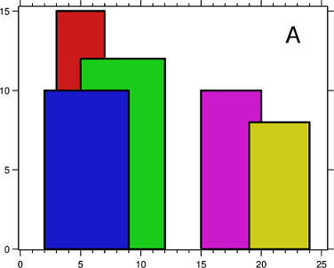
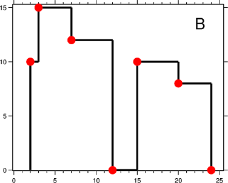

# Skyline

A buling is represented by triplet of integers `[L, R, H]`
- `L` is `x` coordinate of left edge
- `R` is `x` coordinate of right edge
- `H` is its height

Given list of buildings, find the skyline formed by these buildings collectively.

List of buildings `[2 9 10] [3 7 15] [5 12 12] [15 20 10] [19 24 8]` shown in Figure A  
Skyline `[2 10] [3 15] [7 12] [12 0] [15 10] [20 8] [24 0]` shown in Figure B

 

Skyline is list of keypoints shown in red in figure B. A key point is the left endpoint of a horizontal line segment.

~~~
 Input: [0 2 3] [2 5 3]
Output: [0 3] [5 0]

 Input: [1 5 11] [2 7 6] [3 9 13] [12 16 7] [14 25 3] [19 22 18] [23 29 13] [24 28 4]
Output: [1 11] [3 13] [9 0] [12 7] [16 3] [19 18] [22 3] [23 13] [29 0]

 Input: [1 3 3] [2 4 4] [5 8 2] [6 7 4] [8 9 4]
Output: [1 3] [2 4] [4 0] [5 2] [6 4] [7 2] [8 4] [9 0]
~~~

---

Divide given buildings into two halves. Recursively construct skyline for two halves and finally merge the two skylines

skyline for single building is: `{ topLeft, bottomRight }`  
to merge two skylines:
- scan skylines from left to right
- pick keypoint with lowest x
- height is max of current heights from both skylines

~~~java
List<Point> getSkyline(bb Buildings[]) List<Point> {
    return getSkyline(bb, 0, bb.length-1)
}

List<Point> getSkyline(bb Buildings[], int lo, int hi) {
    if(lo>hi) {
       return new ArrayList();
    } else if(lo==hi) {
        List<Point> skyline = new ArrayList();
        skyline.add(new Point(bb[lo].left, bb[lo].height)); // top-left
        skyline.add(new Point(bb[lo].right, 0)); // bottom-right
        return skyline;
    } else {
	    int mid = (lo+hi)/2;
	    List<Point> s1 = getSkyline(bb, lo, mid);
		List<Point> s2 = getSkyline(bb, mid+1, hi);
		return merge(s1, s2);
    }
}

List<Point> merge(List<Point> s1, List<Point> s2) {
    List<Point> s = new ArrayList();
	int i=0, j=0;
	int h1=0, h2=0;
	while(i<s1.size() && j<s2.size()) {
        Point p1 = s1[i], p2=s2[j];
        if(p1.x<p2.x) {
            i++;
            h1 = p1.y;
            addToSkyline(s, new Point(p1.x, max(h1, h2)));
        } else if(p2.x<p1.x) {
            j++;
            h2 = p2.y;
            addToSkyline(s, new Point(p2.x, max(h1, h2)));
        } else {
            i++, j++;
			h1 = p1.y; h2 = p2.y;
            addToSkyline(s, new Point(p1.x, max(h1, h2)));
        }
    }
    while(i<s1.size()) {
        addToSkyline(s, s1[i]);
        i++;
    }
    while(j<s2.size()) {
        addToSkyline(s, s2[j]);
        j++;
    }
	return skyline;
}

void addToSkyline(List<Point> skyline, Point p) {
    if(!skyline.isEmpty() && skyline.last().y==p.y) // skip same height
        return;
    skyline.add(p);
}
~~~

`@src(src/Skyline.java)`

---

### References

* Problem: <https://leetcode.com/problems/the-skyline-problem/>
* Solution: <https://www.geeksforgeeks.org/the-skyline-problem-using-divide-and-conquer-algorithm/>
