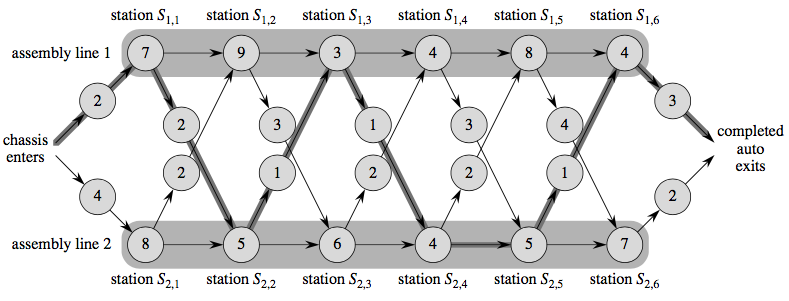

# Assembly-line Scheduling

An automobile factory has two assembly lines. An automobile chassis enteres each assembly line,
has parts added to it at a number of stations, and a finished auto exits at the end of line.

Each assembly line has `$n$` stations, numbered `$j = 1, 2, \dots, n$`. We denote the `$j^{th}$`
station on line `$i$` (where `$i$` is `$1$` or `$2$`) by `$S_{i,j}$`. 

`$S_{1,j}$` performs the same function as `$S_{2,j}$`. The stations were built at different times 
and with different technologies, however, so that the time required at each station varies, even 
between stations at same position on the two different lines.

`$a_{i,j}$` is the assembly time required at station `$S_{i,j}$`  
`$e_i$` is entry time for chassis to enter assembly line `$i$`  
`$x_i$` is exit time for the completed auto to exit assembly line `$i$`

Normally, once a chassis enters an assembly line, it passes through that line only. 
The time to go from one station to the next within the same assembly line is negligible. 

Occasionally a special rush order comes in, and the customer wants the automobile to be 
manufactured as quickly as possible. For rush orders, the chassis still passes through 
the `$n$` stations in order, but the factory manager may switch the partially-completed 
auto from one assembly line to the other after any station.

`$t_{i,j}$` is time to transfer a chassis away from assembly line `$i$` after having gone
through station `$S_{i,j}$`, where `$i=1, 2$` and `$j=1, 2, \dots, n-1$` (since after `$n^{th}$`
station, assembly is complete)


Determine which stations to chose from line 1 and which to chose from line 2 to minimize the total
time through the factory for an auto ?

### Example:



---

Chassis has to go through `n` stations. For each station we have two choices line-1 or line-2.
So there are `$2^n$` possible ways. Hence brute-force way of checking each possible way is not
feasible when `n` is large.

### 1. Prove Optimal Substructure

consider fastest possible ways for a chassis to get from starting point through station `$S_{1,j}$`
* if `$j=1$`, there is only one way
* if `$j=2, 3, \dots, n$`, there are two choices
    * chassis could have come from station `$S_{1,j-1}$` and then directly to station `$S_{1,j}$`
        * suppose this is fastest way, the chassis must have taken a fastest way from starting point
          to through station `$S_{1,j-1}$`. Why ? if there were a fastest way to get through station
          `$S_{1,j-1}$`, we could substitute this fastest way to yield a fastest way through station
          `$S_{1,j}$` → a contradiction 
    * chassis could have come from station `$S_{2,j-1}$` and transfered to station `$S_{1,j}$`
        * suppose this is fastest way, the chassis must have taken a fastest way from starting point
          to through station `$S_{2,j-1}$`. Why ? if there were a fastest way to get through station
          `$S_{2,j-1}$`, we could substitute this fastest way to yield a fastest way through station
          `$S_{1,j}$` → a contradiction 

### 2. Define Recursive Optimal Solution

let `$f_{i,j}$` is fastest possible time to get a chassis from starting point through station `$S_{i,j}$`

`$f_{1,j}=\begin{cases}
e_1 + a_{1,1} & \text{if $j=1$} \\
min(f_{1,j-1}+a_{1,j}, \;\;\;f_{2,j-1}+t_{2,j-1}+a_{1,j}) & \text{if $j>1$} \\
\end{cases}$`

`$f_{2,j}=\begin{cases}
e_2 + a_{2,1} & \text{if $j=1$} \\
min(f_{2,j-1}+a_{2,j}, \;\;\;f_{1,j-1}+t_{1,j-1}+a_{2,j}) & \text{if $j>1$} \\
\end{cases}$`

answer is `$\;min(f_{1,n}+x_1,\;\; f_{2,n}+x_2)$`

### 3. Compute Optimal Cost

```java
int fastestWay(int e[2], int a[2][], int t[2][], int x[2]) {
    int n = a[0].length;
    int f[2][n];
    int b[2][n]; // backtracking
    f[0][0] = e[0] + a[0][0];
    f[1][0] = e[1] + a[1][0];
    for(int j=1; i<n; i++) {
        int x = f[0][j-1] + a[0][j];
        int y = f[1][j-1] + t[1][j-1] + a[0][j];
        if(x<=y)
            f[0][j]=x, b[0][j]=0;
        else
            f[0][j]=y, b[0][j]=1;

        x = f[1][j-1] + a[1][j];
        y = f[0][j-1] + t[0][j-1] + a[1][j];
        if(x<=y)
            f[1][j]=x, b[1][j]=0;
        else
            f[1][j]=y, b[1][j]=1;
    }
    
    int x = f[0][n-1]+x[0];
    int y = f[1][n-1]+x[1];
    if(x<=y) {
        printStations(b, 0, n-1);
        return x;
    } else {
        printStations(b, 1, n-1);
        return y;
    }
}
```

Running Time: `$O(n)$`

### 4. Construct Optimal Solution

```java
void printStations(int b[2][], int line, int station) {
    if(station>0)
        printStations(b, b[line][station], station-1);
    println("line", line, "station", station);
}
```

---

### References

* Chapter 15.1 from CRLS
