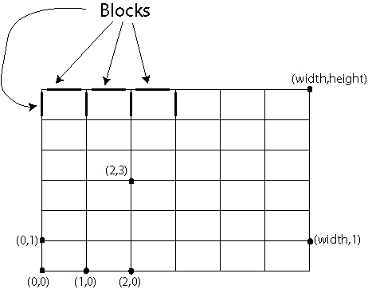
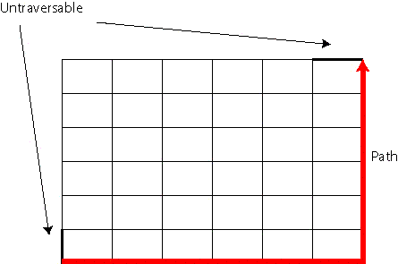

# Avoid Roads

In the city, roads are arranged in a grid pattern. Each point on the grid 
represents a corner where two blocks meet. The points are connected by line 
segments which represent the various street blocks. Using the cartesian 
coordinate system, we can assign a pair of integers to each corner as shown below:



You are standing at the corner with coordinates `(0,0)`. Your destination is at corner `(width,height)`. 
You will return the number of distinct paths that lead to your destination. 

* Each path must use exactly `width+height` blocks. 
* In addition, the city has declared certain street blocks untraversable. 
  These blocks may not be a part of any path. You will be given a `String[] bad` 
  describing which blocks are bad. If (quotes for clarity) `a b c d` is an element of bad, 
  it means the block from corner `(a,b)` to corner `(c,d)` is untraversable. 

for example, `width=6 length=6 bad={"0 0 0 1","6 6 5 6"}`



in above picture:
* untraversable blocks darkened in black. 
* a sample path has been highlighted in red

---

let `c[i][j]` is number of paths to reach `(i,j)`

```bash
c[i][j] = 1 if i=0 or j=0
        = c[i-1][j] + // if (i-1, j) <-> (i, j) is not blocked
          c[i][j-1]   // if (i, j-1) <-> (i, j) is not blocked
```

answer is `c[w][h]`

```java
public static final int HORIZONTAL = 1
public static final int VERTICAL = 2;
public int countPaths(int w, int h, int blocked[][]) {
    // preprocess blocked blocks
    int cantReach[w+1][h+1];
    for(int b[]: blocked) {
        if(b[0]==b[2])
            cantReach[b[0]][max(b[1],b[3])] |= HORIZONTAL;
        else
            cantReach[b[1]][max(b[0],b[2])] |= VERTICAL;
    }

    int c[w+1][h+1];
    for(int i=0; i<=w; i++) {
        for(int j=0; j<=w; j++) {
            if(i==0 || j==0)
                c[i][j] = 1;
            else{
                if(cantReach[i, j-1]&HORIZONTAL==0)
                    c[i][j] += c[i][j-1];
                if(cantReach[i-1, j]&VERTICAL==0)
                    c[i][j] += c[i-1][j];
            }
        }
    }
    return c[w][h];
}
```

Running Time: `$O(wh)$`

---

### References

* <https://community.topcoder.com/stat?c=problem_statement&pm=1889&rd=4709>
