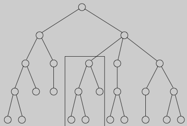

# Dynamic Programming

Dynamic Programming = Smart Recursion = Recursion without Repetition

Dynamic Programming is typically applied to optimization problems

**When to use dynamic programming ?**

* **optimal substructure:**  
  an optimal solution to problem contains within it optimal solutions to subproblems

* **overlapping subproblems:**  
  recursive algorithm revisits the same problem over and over again

**development of dynamic-programming algorithm can be broken into 4 steps:**

* prove that problem exhibits optimal substructure
* recursively define value of an optimal solution
* compute value of an optimal solution in bottom-up fashion
* construct an optimal solution from computed information

**Does all optimization problems exhibit optimal substructure ?**

No. for example:

* **longest path problem:**  
    
  here longest paths from `q` to `t` are: `q->r->t` or `q->s->t`  
  longest path `q->r->t` is not combination of longest path `q` to `r` and longest path from `r` to `t`.  
  because longest path `q` to `r` is `q->s->t->r`

* **least-cost airline fare:**   
  let us say cheapest ticket from `A` to `B` involves stops at `C` and `D`.
  We can't conclude that cheapest ticket from `C` to `B` stops at `D`,
  because price at which airline sells a multi-flight trip is usually not
  sum of the prices at which it would sell individual flights in the trip

## Standard choices for subproblems

* input is `$x_1, x_2, \dots, x_n$`
    * subproblem can be `$x_1, x_2, \dots, x_i$`. Number of subproblems is linear
    * subproblem can be `$x_i, x_{i+1}, \dots, x_j$`. Number of subproblems is `$O(n^2)$`

* input is `$x_1, x_2, \dots, x_m$` and `$y_1, y_2, \dots, y_n$`
    * subproblem is `$x_1, x_2, \dots, x_i$` and `$y_1, y_2, \dots, y_j$`. Number of subproblems is `$O(mn)$`

* input is rooted tree
    * subproblem is a rooted tree  
      
