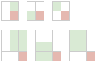

# Largest Square with 1s

Given a binary matrix, find the largest square with all `1`s

`$a=\begin{pmatrix}
1 & 0 & 1 & 0 & 0 \\
1 & 0 & \color{red}1 & \color{red}1 & 1 \\
1 & 1 & \color{red}1 & \color{red}1 & 1 \\
1 & 0 & 0 & 1 & 0
\end{pmatrix} \to 2$`

---

let `L[i][j]` is largest square of `1`s ending at `a[i][j]` (i.e. `a[i][j]` is bottom-right corner)

`$L[i][j]=\begin{cases}
0 & \text{if $a[i][j]=0$} \\
\left.
\begin{array}{l}
1+min( \\
\;\;L[i][j-1], & \text{# left neighbor} \\
\;\;L[i-1][j], & \text{# top neighbor} \\
\;\;L[i-1][j-1] & \text{# top-left neighbor} \\
)
\end{array}
\right\} & \text{if $a[i][j]=1$}
\end{cases}$`

answer is `max(L[][])`

### Why this works ?

* in a square of `$2 \times 2$`, top, left, top-left neighbors of bottom-right corner are `$1 \times 1$` squares
* in a square of `$3 \times 3$`, top, left, top-left neighbors of bottom-right corner are `$2 \times 2$` squares
* in a square of `$n \times n$`, top, left, top-left neighbors of bottom-right corner are `$n-1 \times n-1$` squares
* the reverse is also true



```java
int largestSquare(int a[m][n]) {
    int L[m][n];
    int ans = 0;

    // first row
    for(int j=0; j<n; j++) {
        L[0][j] = a[0][j];
        ans = max(ans, L[0][j]);
    }

    // first column
    for(int i=0; i<m; i++) {
        L[i][0] = a[i][0];
        ans = max(ans, L[i][0]);
    }

    for(int i=1; i<m; i++) {
        for(int j=1; j<n; j++) {
            if(a[i][j]==0)
                L[i][j] = 0;
            else
                L[i][j] = 1 + min(L[i][j-1], L[i-1][j], L[i-1][j-1]);
            ans = max(ans, L[i][j]);
        }
    }

    return ans;
}
```

Time Complexity: `$O(mn)$`  
Space Complexity: `$O(mn)$`

:bulb: current row in `L[][]` only depends on previous row. so further optimizations can be done as in [LCS](lcs.md)

---

### References

* <http://www.techiedelight.com/find-size-largest-square-sub-matrix-1s-present-given-binary-matrix/>
* <https://leetcode.com/articles/maximal-square/>
