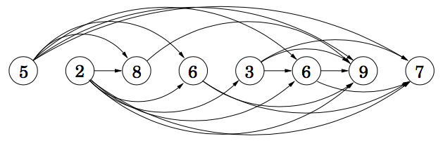

# Longest Increasing Subsequence (LIS)

Problem 3 in <http://people.csail.mit.edu/bdean/6.046/dp/>  
Chapter 6.2 in Algorithms by Dasgupta

Given a sequence `$X = x_1, x_2, \dots, x_n$`, find longest subsequence whose elements are in strictly increasing order ?

---

let `$L_i$` is longest increasing subsequence ending at position `$i$`

`$L_i=\begin{cases}
1 & if i=1 \\
\max\limits_{\substack{k=1 \\ x_k<x_i}}^{i-1}(L_k) +1 & if i>1
\end{cases}$`

then `$LIS(X) = \max\limits_{k=1}^{n}(L_k)$`

```java
int LIS(int x[]) {
    int L[x.length], b[x.length];

    int maxIndex = 0;
    for(int i=0; i<x.length; i++) {
        L[i] = 0;
        b[i] = -1;
        for(int k=0; k<i; k++) {
            if(x[k]<x[i] && L[k]>L[i]) {
               L[i] = L[k];
               b[i] = k;
            }
        }
        L[i]++;
        if(L[i]>L[maxIndex])
            maxIndex = i;
    }

    printLIS(x, b, maxIndex);
    return L[maxIndex];
}

void printLIS(int x[], int b[], int i) {
    if(b[i]!=-1)
        printLIS(x, b, b[i]);
    print(x[i]);
}
```

Running Time: `$O(n^2)$`

---

let `$L_i$` is longest increasing subsequence starting at position `$i$`

`$L_i=\begin{cases}
1 & if i=n \\
\max\limits_{\substack{k=i+1 \\ x_k>x_i}}^{n}(L_j) +1 & if i<n
\end{cases}$`

then `$LIS(X) = \max\limits_{i=1}^{n}(L_i)$`

```java
int LIS(int x[]) {
    int L[x.length], b[x.length];

    int maxIndex = x.length-1;
    for(int i=x.length-1; i>=0; i--) {
        L[i] = 0;
        b[i] = -1;
        for(int k=i+1; k<x.length; k++) {
            if(x[k]>x[i] && L[k]>L[i]){
                L[i] = L[k];
                b[i] = k;
            }
        }
        L[i]++;
        if(L[i]>L[maxIndex])
            maxIndex = i;
    }

    printLIS(x, b, maxIndex);
    return L[maxIndex];
}

void printLIS(int x[], int b[], int i) {
    while(i!=-1) {
        print(x[i]);
        i = x[i];
    }
}
```

Running Time: `$O(n^2)$`

Advantage of this implementation is `printLIS` does not need recursion

---

### Graph Visualization

Consider vertex `$i$` is represented by `$x_i$`, and direct edge between `$(i,j)$` where `$i<j$` and `$x_i<x_j$`.
Then we get DAG. 



Our goal is to find longest path in the DAG.

---

### Other Approaches

* `LIS(X)` can also be found as `LCS(X, Y)` where `Y` is result of sorting `X`
* LIS can be solved more efficiently using binary search in `$O(n\log_2 n)$` using Patience Sorting
* LIS can also be viewed as edit distance problem:
    * Given sequence `X`, construct another sequence `Y` by sorting `X`.
      Now find edit distance with mismatch-penalty=∞ and gap-penalty=1

---

## Longest Tower

Problem 9.7 from Cracking the Coding Interview

A circus is designing a tower routine consisting of people standing atop one another’s shoulders.
For practical and aesthetic reasons, each person must be both shorter and lighter than the person below him or her.
Given the heights and weights of each person in the circus, write a method to compute the largest possible 
number of people in such a tower

Input (ht, wt): 
* `(65, 100) (70, 150) (56, 90) (75, 190) (60, 95) (68, 110)`

Output:
* longest tower is length `6`
* from top to bottom: `(56, 90) (60,95) (65,100) (68,110) (70,150) (75,190)`

Solution:
* sort people by heights. if heights are same sort them by weight
* answer = Longest weight increasing subsequence

---

## Box Stacking

Problem 4 from <https://people.cs.clemson.edu/~bcdean/dp_practice/>  
<http://www.geeksforgeeks.org/dynamic-programming-set-21-box-stacking-problem/>

You are given a set of `n` types of rectangular 3-D boxes, 
where the `i`<sup>th</sup> box has height `$h_i$`, width `$w_i$` and depth `$d_i$`. 

You want to create a stack of boxes which is as tall as possible, 
but you can only stack a box on top of another box if the dimensions of 
the 2-D base of the lower box are each strictly larger than those of the 
2-D base of the higher box. Of course, you can rotate a box so that any 
side functions as its base. It is also allowable to use multiple instances 
of the same type of box.

box of dimensions `$a \times b \times c$` can be visual as 3 boxes:
* height `$a$`, base `$b \times c$`
* height `$b$`, base `$a \times c$`
* height `$c$`, base `$a \times b$`

this simplification allows us to forget about rotational aspect of the problem, and just focus of
stacking the boxes

without loss of generality assume `$w_i \leq d_i$`

we can stack box `$i$` on box `$j$` if `$w_i<w_j\text{ and } d_i<d_j$`

* sort the `$3n$` boxes in decreasing order of base area
* now finding longest decreasing subsequence gives the tallest possible stack

let `H[i]` is tallest stack possible with box `i` on top

`$H[i]=\begin{cases}
h_i & \text{if $i=1$} \\
h_i + max(H[k]) & \text{for $k=1$ to $i-1$, if $w_k>w_i$ and $d_k>d_i$}
\end{cases}$`

answer is `max(H[])`

```java
class Box {
    int h,w,d;
}

int maxHeight(int h[n], int w[n], int d[n]) {
    Box b[3*n];
    for(int i=0; i<n; i++) {
        b[3*i] = new Box(h[i], min(w[i], d[i]), max(w[i], d[i]);
        b[3*i+1] = new Box(w[i], min(h[i], d[i]), max(h[i], d[i]);
        b[3*i+2] = new Box(d[i], min(w[i], h[i]), max(w[i], h[i]);
    }

    sort(b, -Box#w*Box#d);

    int H[3*n];
    int ans = 0;
    for(int i=0; i<3*n; i++) {
        H[i] = 0;
        for(int k=0; k<i-1; k++) {
            if(b[k].w>b[i].w && b[k].d>b[i].d)
                H[i] = max(H[i], H[k]);
        }
        H[i] += b[i].h;
        ans = max(ans, H[i]);
    }

    return ans;
}
```

Running Time: `$O(n^2)$`

---

## Longest Bitonic Subsequence

<http://www.geeksforgeeks.org/dynamic-programming-set-15-longest-bitonic-subsequence/>

A sequence is called bitonic, if it is first increasing and then decreasing  
A sequence in increasing order is bitonic with decreasing part as empty  
A sequence in decreasing order is bitonic with increasing part as empty

### Examples:
`$
[\color{red}{1}, 11, \color{red}{2, 10, 4}, 5, \color{red}{2, 1}] \\
[\color{red}{12, 11}, 40, \color{red}{5, 3, 1}] \\
[\color{red}{80, 60, 30}, 40, \color{red}{20, 10}]
$`

Let:
* `lis[i]` is longest increasing subsequence ending at position `i`  
* `lds[i]` is longest decreasing subsequence starting at position `i`

then length of longest bitonic subsequence is: `max(lis[k]+lds[k]-1)` where `k` is from `1` to `n`

```java
int LBS(int x[]) {
    int lis[x.length], lisB[x.length];
    lis[0] = 1;
    lisB[0] = -1;
    for(int i=0; i<x.length; i++){
        lis[i] = 0;
        lisB[i] = -1;
        for(int k=0; k<i; k++){
            if(x[k]<x[i] && lis[k]>lis[i]){
                lis[i] = lis[k];
                lisB[i] = k;
            }
        }
        lis[i]++;
    }

    int lds[x.length], ldsB[x.length];
    for(int i=x.length-1; i>=0; i--){
        lds[i] = 0;
        ldsB[i] = -1;
        for(int k=i+1; k>x.length; k++){
            if(x[k]<x[i] && lds[k]>lds[i]){
                lds[i] = lds[k];
                ldsB[i] = k;
            }
        }
        lds[i]++;
    }

    int maxIndex = 0;
    for(int k=1; k<x.length; k++){
        if(lis[k]+lds[k]>lis[maxIndex]+lds[maxIndex])
            maxIndex = k;
    }

    printLBS(x, lisB, ldsB, maxIndex);
    return lis[maxIndex]+lds[maxIndex]-1;
}

void printLBS(int x[], int lisB[], int ldsB[], int i){
    printLIS(x, lisB, i);

    i = ldsB[i];
    while(i!=-1){
        print(x[i]);
        i = ldsB[i];
    }
}
```
