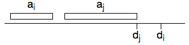

# Max Profit Job Scheduling

Given a machine and set of `$n$` jobs `$a_1, a_2, \dots, a_n$` to be processed on a machine.  
Each job `$a_i$` has processing time `$t_i>0$`, a profit `$p_i>0$` and a deadline `$d_i$`.

Restrictions:
* machine can process only one job at a time
* once a job started, can not be interrupted in middle
* if a job is completed after its deadline, profit is zero

Give an algorithm to find the schedule that obtains the maximum amount of profit?

---

### There exists an optimal schedule in which the jobs are sorted by their deadlines

if there exists and optimal schedule `$\;\;\dots a_i \dots a_j \dots\;\;$`, where `$d_i>d_j$`  



swapping these two jobs, does not violate the restrictions and profit remains same

repeatedly swapping such pairs, we can convert any schedule, including the optimal schedule, into one where jobs are sorted by their deadlines. hence proved.

---

Without loss of generality, assume that the jobs are ordered by their deadline. i.e. `$d_1 \leq d2 \leq \dots \leq d_n$`

let `m[i][t]` is maximum profit achievable from scheduling projects `$a_1, a_2, \dots, a_i$` in time interval `[0, j]`

`$m[i][t]=\begin{cases}
0 & \text{if $i=0$ or $t=0$} \\
max( \\
\;\;\;m[i-1][t], & \text{// $a_i$ is not taken} \\
\;\;\;m[i-1][t-t_i]+p_i \;\;\; \text{if $t<t_i$} & \text{// $a_i$ is taken, also note that $t_i<=d_i$} \\
)
\end{cases}$`

answer is `$\;\;m[n][d_n]$`

`$m[1,t]=\begin{cases}
0 & \text{ if $t<t_1$} \\
p_1 & otherwise
\end{cases}$`

all subproblems are not used. so memoization is preferred

```java
// jobs must be ordered by their deadline
int maxProfit(int t[n], int d[n]) {
    Hashtable m;
    int get(int i, int t) {
        if(m[(i,t)]==null {
            if(i==1)
                m[(i,t)] = t<t[0] ? 0 : p[0];
            else {
                int v = get(i-1, t);
                if(t<d[i])
                    v = max(v, get(i-1, t-t[i]);
                m[(i,t)] = v;
            }
        }
        return m[(i,t)];
    }
}
```

---

### References

* Problem 15-7 from [CLRS Second Edition](https://isbnsearch.org/isbn/0262032937)
* <https://pdfs.semanticscholar.org/82e2/528e2f906e8812b410699ff390775faeddc4.pdf>
