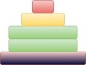
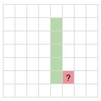

# Tile Stacking

A stable tower of height `n` is a tower consisting of exactly `n` tiles 
of unit height stacked vertically in such a way, that no bigger tile is 
placed on a smaller tile. An example configuration is shown below:



Given `k` tiles of each size `$1, 2, \dots, m$`, calculate the number of 
different stable towers of height `n`  that can be built.

i.e. you can use at most `k` tiles of each size in the tower

```
n=3 m=3 k=1 ➜ 1
{1, 2, 3}

n=3 m=3 k=2 ➜ 7
{1, 1, 2}, {1, 1, 3}, {1, 2, 2}, {1, 2, 3}, {1, 3, 3}, {2, 2, 3}, {2, 3, 3}

n=3 m=4 k=1 ➜ 4
{1, 2, 3}, {1, 2, 4}, {1, 3, 4}, {2, 3, 4}
```

since the number of different stable towers can be huge, output this number modulo `$10^9+7$`

---

the problem boils down to calculating number of increasing sequences of length `n`
using numbers `1` to `m` using each number at most `k` times

let `c[i][j]` is number of stable towers of size `i` using tiles of size `1` to `j`

`$c[i][j]=\begin{cases}
1 & \text{if $i=0$ and $j=0$} \\
0 & \text{if $i>0$ and $j=0$} \\
\sum c[i-x][j-1] & \text{for $x=0$ to $min(i,k)$} & \text{# $x$ tiles for size $j$ used}
\end{cases}$`

answer is `c[n][m]`

Running Time will be `$O(nmk)$`



current entry is sum of `min(i,k)+1` entries adjacent to it in previous column  
if we calculate entries column-wise, then we can compute this sum effectively

```java
int stableTowers(int n, int m, int k) {
    int c[n+1][m+1];
    
    // column 0
    c[0][0] = 1;
    for(int i=1; i<=n; i++)
        c[i][0] = 0;

    for(int j=1; j<=m; j++) {
        int sum = 0;
        for(int i=0; i<=n; i++) {
            sum += c[i][j-1];
            sum %= 1000000007;
            if(i>k) {
                sum -= c[i-k-1][j-1];
                if(sum<0)
                    sum += 1000000007;
            }
            c[i][j] = sum;
        }
    }

    return c[n][m];
}
```

Time Complexity: `$O(nm)$`  
Space Complexity: `$O(nm)$`

:bulb: current column only depends on previous column, so we need only two columns at any point

---

### References

* <https://www.hackerrank.com/contests/moodys-analytics-fall-university-codesprint/challenges/tile-stacking-problem/problem>
* <http://www.geeksforgeeks.org/tile-stacking-problem/>
