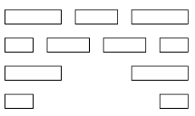

# Activity Selection Problem

Chapter 16.1 from [CLRS Second Edition](https://isbnsearch.org/isbn/0262032937)  
Exercises 16.1-2, 16.1-3, 16.1-4 from [CLRS Second Edition](https://isbnsearch.org/isbn/0262032937)

Given set `$S=\{a_1, a_2, \dots, a_n\}$` of `n` proposed activities that 
wish to use a resource, such as lecture hall, which can be used by only 
one activity at a time.

Each activity `$a_i$` has a start time `$s_i$` and a finish time `$f_i$`,
where `$0 \leq s_i < f_i \leq \infty$`. If selected, activity `$ai$` takes
place during the half open interval `$[s_i, f_i)$`.

Activities `$a_i$` and `$a_j$` are compatible if their intervals do not overlap
i.e. `$\text{$s_j \geq f_i$ or $s_i \geq f_j$}$`  
Find maximum-size subset of mutually compatible activities ?

---

Let `$S_{ij}$` is subset of activities that can start after `$a_i$` finished and finished before `$a_j$` starts  
i.e. `$\;S_{ij}= \{a_k \in S \;:\; f_i \leq s_k < f_k \leq s_j\}$`

in order to represent entire problem, add fictitious activities `$a_0$` and `$a_{n+1}$` with `$f_0=0$` and `$s_{n+1}=\infty$`  
then `$\;S=S_{0\;n+1}$`

Let us assume that the activities are sorted in increasing order of finish time  
i.e `$\;f_0 \leq f_1 \leq f_2 \leq \dots \leq f_n \leq f_{n+1}$`

**claim:** `$\;S_{ij}=\emptyset \text{ if $i \geq j$}$`  
**proof:** suppose there exists an activity `$a_k \in S_{i,\;j}$`, then `$f_i \leq s_k < f_k \leq s_j < f_j$`. 
thus `$f_i<f_j$` which contradicts our assumption that `$a_i$` follows `$a_j$` in the sorted order

### Optimal Substructure

Suppose optimal solution for `$S_{ij}$` is `$A_{ij}$`, which includes some activity `$a_k$`  
let `$A_{ik}=A_{ij} \cap S_{ik}$` and `$A_{kj}=A_{ij} \cap S_{kj}$`, then we have:
* `$A_{ij}=A_{ik} \cup \{a_k\} \cup A_{kj}$` 
* `$\vert A_{ij} \vert=\vert A_{ik} \vert + 1 + \vert A_{kj} \vert$` 


we claim that `$A_{ik}$` and `$A_{kj}$` are optimal solutions for `$S_{ik}$` and `$S_{kj}$` respectively

suppose there exists optimal solution `$A'_{ik}$` where `$\vert A'_{ik} \vert > \vert A_{ik} \vert$`  
then we could use `$A'_{ik}$`, rather than `$A_{ik}$`, in optimal solution of `$S_{ij}$`  

`$\begin{align}
\vert A'_{ik} \vert + 1 + \vert A_{kj} \vert & > \vert A_{ik} \vert + 1 + \vert A_{kj} \\
& > \vert A_{ij} \vert
\end{align}$`

this contradicts the assumption that `$A_{ij}$` is an optimal solution.

a symmetic argument applies to `$S_{kj}$` also

### Greedy Choice

:heavy_check_mark: **chose the activity with earliest finish time**

**Theorem:** consider non empty subproblem `$S_{ij}$`, and let `$a_m$` be the activity in `$S_{ij}$` with the earliest finish time. 
Then there exists an optimal solution to `$S_{ij}$` that includes `$a_m$`   
**Proof:** suppose there exists an optimal solution `$A_{ij}$` which does not include `$a_m$`  
let `$a_k$` be the first activity in `$A_{ij}$`  
construct subset `$A'_{ij} = A_{ij} - \{a_k\} \cup \{a_m\}$`  
activities in `$A'_{ij}$` are compatible, because `$f_m \leq f_k$`  
we just constructed optimal solution to `$A_{ij}$` that includes `$a_m$`. hence proved

```java
int[] maxCompatible(int s[n], int f[n]) {
    sort s and f by f
    int ans[] = {0};
    int k = 0;
    for(int i=1; i<n; i++) {
        if(f[i]>=f[k]) {
            ans.append(i);
            k = i;
        }
    }
    return ans;
}
```

:heavy_check_mark: **chose the activity with last start time**

**Theorem:** consider non empty subproblem `$S_{ij}$`, and let `$a_m$` be the activity in `$S_{ij}$` with the largest start time. 
Then there exists an optimal solution to `$S_{ij}$` that includes `$a_m$`   
**Proof:** suppose there exists an optimal solution `$A_{ij}$` which does not include `$a_m$`  
let `$a_k$` be the last activity in `$A_{ij}$`  
construct subset `$A'_{ij} = A_{ij} - \{a_k\} \cup \{a_m\}$`  
activities in `$A'_{ij}$` are compatible, because `$s_m \geq s_k$`  
we just constructed optimal solution to `$A_{ij}$` that includes `$a_m$`. hence proved

```java
int[] maxCompatible(int s[n], int f[n]) {
    sort s and f by s
    int ans[] = {n-1};
    int k = n-1;
    for(int i=n-2; i>=0; i--) {
        if(s[i]<=s[k]) {
            ans.append(i);
            k = i;
        }
    }
    return ans;
}
```

:x: **chose the activity with earliest starting time**


:x: **chose the activity with least duration**


:x: **chose the activity that overlaps with fewest other activities**



* optimal solution: 4 activities in second row
* greedy solution: selects the middle activity in top row, which does not yield optimal solution

---

Determine minimum lecture halls required to schedule all activities ?

this is also known as **interval-graph coloring problem**. Create an interval graph where
activities are vertices and edges connect incompatible activities. Then the problem turns into 
finding smallest colors required to color every vertex such that no two adjacent vertices are given
same color.

* maintain two lists of lecture halls:
    * busy currently
    * free currently
* sort start and finish times. if start and finish are same finish should come first
* scan them from left to right
    * if start time encountered, move hall from free to busy
    * if finish time encountered, move hall from busy to free
    * if no halls in free list, create new hall

**Proof:**  
assume the algorithm used `m` halls. Consider some activity `a` that was the first 
scheduled activity in lecture hall `m`. activity `a` was put in the `m`th hall because all of 
the `m−1` halls were busy. i.e. at the time `a` is scheduled there are `m-1` other activities occuring 
simultaneously. Any algorithm must therefore use at least `m` halls, and the algorithm is thus optimal.

```java
int minHalls(int s[n], int f[n]) {
    sort(s);
    sort(f);
    int count=0, busy=0;
    int i=0, j=0;
    while(i<n) {
        if(s[i]<f[j]) {
            busy++;
            count = max(count, busy);
            i++;
        } else {
            busy--;
            j++;
        }
    }
    return count;
}
```

Time Complexity: `$O(n \log_2 n)$`  
Space Complexity: `$O(1)$`

---

Determine which activity should use which lecture hall ?

```java
int[] halls(int s[n], int f[n]) {
    int a[2*n];
    for(int i=0; i<n; i++) {
        a[2*i] = i+1; // start of i-th activity
        a[2*i+1 = -(i+1); // finish of i-th activity
    }
    int compare(int v1, int v2) {
        v1 = v1>0 ? s[v1-1] : f[abs(v1)-1];
        v2 = v2>0 ? s[v2-1] : f[abs(v2)-1];
        return v1-v2;
    }
    stableSort(a, #compare);

    Queue busy, free;
    int halls[]; // i-th activity uses halls[i]
    for(int i=0; i<2*n; i++) {
        if(a[i]>0) {
            int activity = a[i]-1;
            if(free.isEmpty())
                halls[activity] = busy.size();
                busy.enqueue(busy.size());
            else {
                int hall = free.dequeue();
                halls[activity] = hall;
                busy.enqueue(hall);
            }
        } else 
            free.enqueue(busy.dequeue());
    }

    return halls;
}
```

---

### Similar Problem

<http://www.geeksforgeeks.org/minimum-number-platforms-required-railwaybus-station/>

Given arrival and departure times of all trains that reach a railway station, 
find the minimum number of platforms required for the railway station so that no train waits

