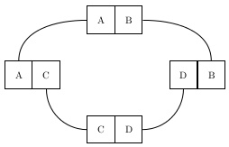

# Airline Seating

Quiet frequently passengers on a flight want to have seat next to his/her buddy.
Now if on a certain flight, there are too many such requests, a hostess may think
about the minimum number of swaps required to satisfy every one; and create as 
little ruckus as possible in the process.

let us say a passenger is happy if he/she is seated to his/her buddy and call it a
happy pair. Given any seat arrangement initially, we want to go to an arrangement
where everyone is happy with minimum swaps.

Example:  
A **B** B C **A** C → A A B **C B** C → A A B B C C

---

### Greedy Algorithm

There are `k` pairs in input array `A[2k]`  

`$\begin{matrix}
AB & CD & XY & XY & AC & DB \\
P_0 & P_1 & P_2 & P_3 & P_4 & P_5
\end{matrix}$`

`$Pair\;P_i = (A[2i],\;A[2i+1])\;\;for\;every\;i \in [0, k)$`

```bash
for i = [0,k) do
    if (A[2i],A[2i+1]) is not happy pair:
        swap A[2i+1] with the buddy of A[2i]
```

```java
void reArrange(int a[]) {
    for(int i=0; i<len; i+=2) {
        if(a[i]!=a[i+1]) {
            int buddy = indexOf(a, from:i+2, val:a[i]);
            a[i+1] ⬌ a[buddy];
        }
    }
}
```

---

### Proof

*complete pair set* = set of pairs such that for every entity in set, its buddy is also in same set  
*minimal complete pair set* = a complete pair set which cannot be further divided into complete pair sets

minimal complete sets in above example are: `$\{P_0, P_1, P_4, P_5\} \;and\; \{P_2, P_3\}$`

if there are `k` pairs in input, then our goal is to divide given permutation into `k` minimal complete pair sets with minimum #swaps

each minimal complete pair set can be viewed as *loop graph* where buddies in separate pairs are connected by an edge



with each swap, we can split one loop at most into two loops  
in other words, one swap can at most increase minimal complete pair sets by one

so min swaps reqd for minimum complete pair set `S` = `len(S)-1`

if the input contains `$x$` minimal complete pair sets, then min swaps reqd  
`$= (len(S_0)-1) + (len(S_1-1) + \dots + (len(S_{x-1}-1)$`  
`$= 2k - x$`

so, as long as with each swap, we keep on increasing the minimum complete pair sets, we are proceeding optimally

our algorithm mentioned above, has this property, hence it is an optimal algorithm

---

### References

* <https://www.slideshare.net/anirbanmitra9231/airline-seatproblem>
