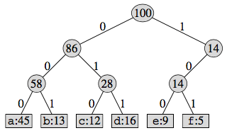
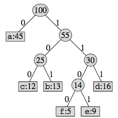
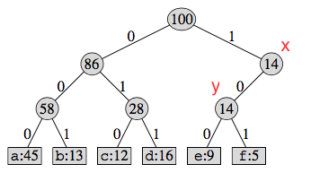
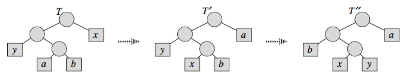

# Huffman Codes

Chapter 16.3 from [CLRS Second Edition](https://isbnsearch.org/isbn/0262032937)

Given `1000000` character data file, that needs to be compressed. The characters in file are `$c_1, c_2, \dots, c_n$`
and their frequences are `$f_1, f_2, \dots, f_n$`. Construct binary character code for each character, to maximize
compression ?

`$\begin{array}{c|ccc}
\text{character} & a & b & c & d & e & f \\
\hline
\text{frequency(in thousands)} & 45 & 13 & 12 & 16 & 9 & 5
\end{array}$`

---

binary tree representation:
* leaves are characters
* interpret binary code of character as path from root to that character, where:
    * `0` means "go to left child"
    * `1` means "go to right child"

**if fixed-length code used:**

`a=000, b=001, c=010, d=011, e=100, f=101`  


`3` bits are enough to represent `6` characters  
#bits in file = `100000*3 = 300000`

**if variable-length code used:**

`a=0, b=101, c=100, d=111, e=1101 f=1100`  


#bits in file = `(45*1+13*3+12*3+16*3+9*4+5*4)*1000 = 224000`  
approximately `25%` savings

**prefix-codes:**

variable-length codes should be constructed such that, no code is prefix of another.
otherwise decoding is not possible

for example: 
* if `a=0, b=10, c=100` (`b` is prefix of `c`)
* `1000` can be decoded to `baa` or `ca`

variable-length codes satisfying this property are called *prefix-free codes* or *prefix codes*

---

**claim 1:** a binary tree that is not full cannot correspond to an optimal prefix code  

a binary tree is full, if every non-leaf node has two children  


let `T` is non-full binary tree that corresponds to optimal prefix code  
there must be in internal node `x`, that has single child `y`  
construct another tree `T'`, by replacing `x` with `y` as below:


now in `T'`:
* all leaves in subtree rooted at `y` has strictly one less depth than in `T`
* rest of the leaves have their depth same as in `T`

i.e. `T'` is more optimal than `T`. this is contradiction. hence proved.

---

### Greedy Choice

* create leaf node for each character frequency. i.e, we have list of `n` nodes
* repeat until we have single node
    * remove two nodes `x` and `y` of lowest frequency from list
    * create new node `z` with `x` and `y` as children and frequence `x+y`
    * add `z` to list

:bulb: use minHeap to efficiently extract min node

```java
Node constructTree(int f[n]) {
    Node nodes[n];
    for(int i=0; i<n; i++)
        nodes[i] = new Node(f[i]);

    MinHeap heap = new MinHeap(nodes);
    while(heap.size()>1) {
        Node x = heap.deleteMin();
        Node y = heap.deleteMin();
        Node z = new Node(x.data+y.data);
        z.left = x;
        z.right = y;
        heap.add(z);
    }

    return heap.min();
}
```

Running Time: `$O(n)$`

let:
* `$C$` is alphabet from which characters are drawn
* `$f_c$` is frequency of character `c`
* `$d_c$` is depth of leaf node of character `c` in tree
* `$B$` is #bits required to encode file

`$B=\sum\limits_{c\in C} f_cd_c$`

alternatively, `B` can be computed by adding all internal nodes

```java
int minBits(int f[n]) {
    int bits = 0;
    MinHeap heap = new MinHeap(f);
    while(heap.size()>1) {
        int v = heap.deleteMin() + heap.deleteMin();
        bits += v;
        heap.add(v);
    }
    return bits;
}
```

:bulb: the tree contains `n` leaves and `n-1` internal nodes

---

### Prove Greedy Choice

**claim:** let `x` and `y` are two character having lowest frequencies. Then there exists
an optimal prefix code in which binary codes of `x` and `y` have same length and differ 
only in last bit.

in other words, we have to prove that: there exists a binary tree with `x` and `y` as siblings
which corresponds to an optimal prefix code



take tree `T` representing an arbitary optimal prefix code
* let `a` and `b` be two characters that are sibling leaves of maximum depth
* without loss of generality, assume `$f_a \leq f_b$`
* since `$f_x$` and `$f_y$` are two lowest frequences:
    * we have `$f_x \leq f_a$` and `$f_y \leq f_b$`

exchange positions of `a` and `x` in `T` to produce tree `T'`  
difference in cost is:

`$\begin{align}
B-B'&=\sum\limits_{c \in C} f_c d_c - \sum\limits_{c \in C} f_c d'_c \\
&=f_xd_x + f_ad_a - f_xd'_x - f_ad'_a \\
&=f_xd_x + f_ad_a - f_xd_a - f_ad_x & (\because \text{$d'_x=d_a$ and $d'_a=d_x$})\\
&=(f_a-f_x)(d_a-d_x)
\end{align}$`

`$f_a-f_x \geq 0$` because `$f_x \leq f_a$`  
`$d_a-d_x \geq 0$` because `a` is leaf of maximum depth in `T`  
since both are `$\geq 0$`, we have: `$B-B' \geq 0$`  
since `T` is optimal prefix code, we have: `$B-B'=0 \implies B=B'$` 

similary exchange positions of `b` and `y` in `T'` to produce tree `T"`  
same way we can show that: `B'=B"`

which implies: `B=B"`

we just constructred optimal tree `T"` in which `x` and `y` are sibling leaves of maximum depth. hence proved.

---

### Prove Optimal Substructure

**claim:**  
let `$x$` and `$y$` be two characters with lowest frequencies in `$C$` and new character `$z$` where `$f_z=f_x+f_y$`  
consider subproblem with `$C'=C-\{x,y\}\cup\{z\}$`  
if `$T'$` is optimal tree for `$C'$`, then the tree `$T$` constructed by replacing leaf node `$z$` with an internal node
having `$x$` and `$y$` as children is an optimal tree of `$C$`

**proof:**

let us express `$B$` in terms of `$B'$`

for each `$c \in C -\{x,y\}$`, we have:
* `$d_c=d'_c$` hence `$f_cd_c=f_cd'_c$`
* since `$d_x=d_y=d'_z+1$`, we have  
  `$\begin{array}{l}
  f_xd_x + f_yd_y &= (f_x+f_y)(d'_z+1) \\
  &=f_zd'_z+(f_x+f_y)
  \end{array}$`
* from this we conclude that: 
    * `$B=B'+f_x+f_y$`
    * `$B-=B-f_x-f_y$`

let us prove by contradiction: 
* suppose `T` is not optimal tree for `C`, then there exists a tree `T"` such that `B"<B`
* without loss of generality(by earlier claim), `T"` has `x` and `y` as siblings
* in `$T''$` replace common parent of `x` and `y` with leaf `z` to construct `$T'''$`  
  `$\begin{array}{l}
  B''' &= B"-f_x-f_y \\
  &<B-f_x-f_y \\
  &<B'
  \end{array}$`
    * this contradicts our assumption that `T'` is optimal tree for `C'`  
    * thus `T` must be optimal tree for `C`

---

### Optimal Merge Pattern

Given `n` sorted sequences of lengths `$l_1, l_2, \dots, l_n$`, Find optimal merge pattern
that minimizes number of moves ?
* only two sequences can be merged at once
* merging lists of lengths `$l_i$` and `$l_j$` requires `$l_i+l_j$` moves

the solution is same as previous problem

```java
class Node {
    int len;
    String pattern;
}

String optimalMergePattern(int len[n]) {
    Node nodes[n];
    for(int i=0; i<n; i++)
        nodes[i] = new Node(len[i], String.valueOf(len[i]));

    MinHeap heap = new MinHeap(nodes);
    while(heap.size()>1) {
        Node x = heap.deleteMin();
        Node y = heap.deleteMin();
        heap.add(new Node(x.len+y.len, "("+x.pattern+"+"+y.pattern+")"));
    }
    return heap.min().pattern;
}
```
