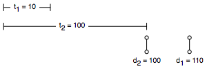
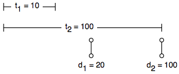
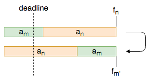
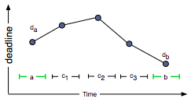

# Schedule to minimize Lateness

Given `$n$` jobs with deadlines `$d_i$` and processing-times `$t_i$` to be scheduled on a single resource  
if a job `$i$` starts at time `$s_i$`, then it will finish at time `$f_i=s_i+t_i$`  
lateness of a job is `$l_i=max(0, \;f_i-d_i)$`  
schedule all jobs such that `$L=max(l_i)$` is minimized

`$\begin{array}{c|ccc}
i & 1 & 2 & 3 & 4 & 5 & 6 \\
\hline
t_i & 3 & 2 & 1 & 4 & 3 & 2 \\
d_i & 6 & 8 & 9 & 9 & 14 & 15
\end{array} \to
\begin{array}{c|ccc}
i & 3 & 2 & 6 & 1 & 5 & 4 \\
\hline
f_i & 1 & 3 & 5 & 8 & 11 & 15 \\
l_i & 0 & 0 & 0 & 2 & 0 & 6
\end{array}$`

---

:x: **shortest job first**

i.e. sort according to `$t_i$`



* greedy:
    * `$a_1, a_2$`
    * lateness = max(0, 110-100) = 10
* optimal:
    * `$a_2, a_1$`
    * lateness = max(0, 0) = 0

:x: **shortest slack first**

i.e. sort according to `$d_i-t_i$`



* greedy:
    * `$a_2, a_1$`
    * lateness = max(0, 110-20) = 90
* optimal:
    * `$a_1, a_2$`
    * lateness = max(0, 110-100) = 10

:heavy_check_mark: **earliest deadline first**

i.e. sort according to `$d_i$`

*idle-time* is gaps in schedule where no actvitity is performed.  
it is obvious that: 
* given any schedule with gaps, closing the gaps may decrease the maximum lateness, but never increases
* so we conclude that, there exists an optimal solution with no idle time

*inversion* is a pair of jobs `$a_m$`, `$a_n$` such that `$a_m$` is scheduled before `$a_n$`, but `$d_m>d_n$`  

**Theorem:** interchanging the jobs of an adjacent inversion, does not increase the maximum lateness  
**Proof:**  


consider imaginary deadline shown in dotted vertical line. after interchanging:
* `$l_m$` increases
* `$l_n$` decreases

`$\begin{align}
l_{m'} & = f_{m'} - d_m \\
       & = f_n - d_m & \text{# $f_n=f_{m'}$} \\
       & \leq f_n - d_n & \text{# $d_m>d_n$} \\
       & \leq l_n
\end{align}$`

i.e. `$l_m$` increases at most to `$l_n$`, but not beyond.  
hence proved

**Theorem:** there exists an optimal solution without inversions  
**Proof:**  
supppose there exists an optimal solution which inversion, it must have an adjacent inversion `i`, `j`  


by previous theorem: we could interchange activies `i` and `j`, without increasing maximum lateness, 
thus reducing number of inversions by `1`

if we keep interchanging adjacent inversions, we will eventually arrive a solutions with no inversions,
without increasing maximum lateness

hence proved

```java
int minLateness(int t[n], int d[n]) {
    sort t and d by d;
    int f = 0;
    int lateness = 0;
    for(int i=0; i<n; i++) {
        f += t[i];
        if(f>d[i])
            lateness = max(lateness, d[i]-f);
    }
    return lateness;
}
```

---

### References

* <https://www.cs.umd.edu/class/fall2009/cmsc451/lectures/Lec05a-minlate.pdf>  
  <https://www.youtube.com/watch?v=zH4z15UpABs>
