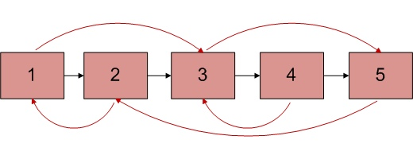

# Clone Linked List with next and arbit Pointer

Given linked list where each node has two pointers next and arbit, where arbit can point to any node. Clone it?



```java
Node copy(Node head) {
    if(head==null)
        return null;

    // insert copy of node1 between node1 and node2  
    // insert copy of node2 between node2 and node3  
    // and so on
    Node cur = head;
    do {
        Node copy = new Node(cur.data);
        copy.next = cur.next;
        cur.next = copy;
        cur = cur.next.next;
    } while(cur!=null)

    // copy arbit pointers
    cur = head;
    do {
        if(cur.arbit!=null)
            cur.next.arbit = cur.arbit.next;
        cur = cur.next.next;
    } while(cur!=null)

    // restore original and cloned linked lists
    final Node clone = head.next;
    cur = head;
    Node copy = clone;
    while(true) {
        cur.next = copy.next;
        cur = cur.next;
        if(cur==null)
            break;
        copy.next = cur.next;
    }

    return clone;
}
```

### References

* <http://www.geeksforgeeks.org/a-linked-list-with-next-and-arbit-pointer/>
