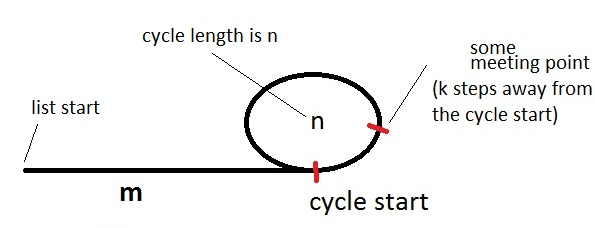

# Detect and Remove Loop in Linked List

Detect if loop is present in given Singly Linked List, if present remove it.


---

## Floyd's cycle-finding algorithm

### Detecting Loop:

Take two pointers namely tortoise and hare pointing to the beginning of list.
If we move tortoise 1 step at a time, and hare 2 steps at a time, they will
eventually meet some where in the loop. if hare reaches end of list before
meeting, it means there is no cycle.

**Proof:**



let us say `p` and `q` are the number of rotations completed by tortoise and hare before they met.

```
i = m + pn + k // #steps taken by tortoise
2i = m + qn + k // #steps taken by hare

2(m + pn + k) = m + qn + k
2m + 2pn + 2k = m + qn + k
m + k = qn - 2pn
m + k = (q - 2p) * n
```

here `m` and `n` are given properties of list.  
if we can find at least one set of values for `k`, `p` and `q` satisfying the above equation, then we can guarantee that they meet each other.

consider:
```
p = 0;
q = m
k = mn - m
```

on substituting:
```
m + mn - m = (m - 2*0) * n
mn = mn
```

then `i` will be:
```
i = m + 0*n + mn - m = mn
```

note that this is not necessarily the smallest `i` possible. In other words, tortoise and hare
might have met before many times.

```java
boolean hasCycle(Node head){
    if(head==null || head.next==null)
        return false;

    tortoise = head;
    hare = head.next.next;
    while(hare!=null && hare.next!=null){
        if(hare==tortoise)
            return true;
        tortoise = tortoise.next;
        hare = hare.next.next;
    }
    return false;
}
```

---

## Finding Cycle Start

since `m + k = (q - 2p) * n`:
- `m+k` steps is multiple of cycle length `n`
- moving `m+k` steps would reach to the same point
- if we move only `m` steps:
    - we are `k` steps away from completing cycle
    - means we are at beginning of cycle

so if we move tortoise to beginning, and move both hare and tortoise one step per iteration, they would meet at cycle start point

```java
Node cycleStart(Node head){
    if(head==null || head.next==null)
        return null;

    tortoise = head;
    hare = head.next.next;
    while(hare!=null && hare.next!=null){
        if(hare==tortoise)
            break;
        tortoise = tortoise.next;
        hare = hare.next.next;
    }
    if(hare!=tortoise)
        return null; // no cycle

    tortoise = head;
    while(tortoise!=hare){
        tortoise = tortoise.next;
        hare = hare.next;
    }
    return tortoise;
}
```

---

## Remove Cycle

```java
void removeStart(Node head){
    if(head==null || head.next==null)
        return;

    tortoise = head;
    hare = head.next.next;
    while(hare!=null && hare.next!=null){
        if(hare==tortoise)
            break;
        tortoise = tortoise.next;
        hare = hare.next.next;
    }
    if(hare!=tortoise)
        return; // no cycle

    tortoise = head;
    while(tortoise.next!=hare.next){
        tortoise = tortoise.next;
        hare = hare.next;
    }
    hare.next = null;
}
```

---

### References

- <https://www.geeksforgeeks.org/detect-and-remove-loop-in-a-linked-list/>
- <https://stackoverflow.com/a/6110767/104018>
