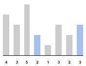
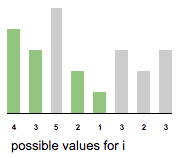
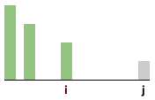

# Distance Maximizing increasing Pair

Given an array `a[]`, find pair `(i, j)` with maximum `j–i` such that `i<j` and `a[i]<a[j]`

{4, 3, 5, **2**, 1, 3, 2, **3**}  
{34, **8**, 10, 3, 2, 80, 30, **33**, 1}  
{**9**, 2, 3, 4, 5, 6, 7, 8, **18**, 0}  
{**1**, 2, 3, 4, 5, **6**}  
{6, 5, 4, 3, 2, 1} => none

---



let us say we know `i`, `j` such that `i<j` and `a[i]<a[j]`
* if there is element smaller than `a[i]` to the left of `a[i]`, we can move `i` to that place
* if there is element greater than `a[j]` to the right of `a[j]`, we can move `j` to that place

so possible values of `i` in pair, are those which are smaller than its left values.



if `j` can't pair with some possible `i`, then it can't pair with any left values of possible `i` 



```java
int[] findPair(int a[]) {
    // compute possible values for i in pair
    iValues = new Stack();
    iValues.push(0)
    for(int i=1; i<a.length; i++) {
        if(a[i]<a[iValues.top()])
            iValues.push(i);
    }

    int maxi=0, maxj=0;
    for(j=a.length-1; j>0; j--) {
        while(!iValues.isEmpty() && a[j]>a[iValues.top()]) {
            int i = iValues.pop();
            if(j-i > maxj-maxi) {
                maxi = i;
                maxj = j;
            }
        }
        if(iValues.isEmpty())
            break;
    }
    
    if(maxj-maxi==0)
        return null;
    return new int[]{maxi, maxj}
}
```

this works even if array contains -ve numbers.

Running Time: `$O(n)$`

### References

* <http://articles.leetcode.com/a-distance-maximizing-problem>
* <https://gist.github.com/senvey/fed51b846fa69fc8bcd1>
