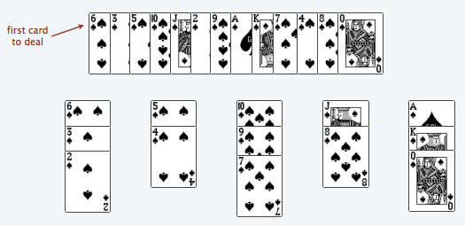
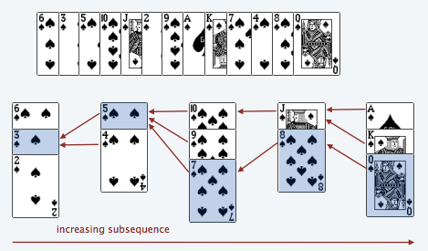

# Longest Increasing Subsequence

Given a sequence `$X = x_1, x_2, \dots, x_n$`, find longest subsequence whose elements are in strictly increasing order ?

---

<http://www.cs.princeton.edu/courses/archive/spring13/cos423/lectures/LongestIncreasingSubsequence.pdf>

**Solitaire Game:**  

We have cards `$c_1, c_2, \dots, c_n$`. Pick/deal each card in order and arrange them into piles, according to following rules:
* should not place bigger card on smaller card
* you can create new pile

to minimize #piles, use greedy approach: place each card on left most pile that fits  


notice that:
* at any stage during process, top cards of piles increase from left to right
* cards within a file, form decreasing subsequence

for each card, maintain pointer to top card in previous pile, at time of insertion:  


notice that:
* any increasing subsequence, uses at most one card from each pile
* length of longest increasing subsequence is #piles. LIS can be constructed using pointers from last pile to first pile

```java
int lis(int a[n]) {
    int top[n]; // top[i] is index of i-th pile top card
    int pred[n]; // pred[i] if index of predecessor of a[i]
    int piles = 0;
    for(int i=0; i<n; i++) {
        int p = ceil(a, top[0...piles-1], a[i]); // by binary search
        if(p==-1) {
            piles++;
            p = piles-1;
        }
        top[p] = i;
        pred[i] = p>0 ? top[p-1] : -1;
    }
    printLIS(a, pred, top[piles-1]);
    return piles;
}

void printLIS(int a[], int pred[], int i) {
    if(i!=-1) {
        printLIS(a, pred, pred[i]);
        println(a[i]);
    }
}
```

Running Time: `$O(n \log_2 n)$`

notice that, at any stage during algorithm:
* `top[i]` contains smallest ending value among all possible increasing sequences of length `i`
* instead of tracking all increasing sequences of length `i`, we are just tracking the one which ends with smallest value. because such sequence has better chance of growing in later stage compared to others

---

**Theorem:** Any sequence of `$n^2+1$` distinct numbers, either has increasing or decreasing subsequence of size `$n+1$`.

<https://www.cc.gatech.edu/~jarek/courses/1050/slides/X12bPigeonHole.ppt>

Let the sequence is `$a_1, a_2, \dots, a_{n^2+1}$`  
for each element `$a_k$` associate an ordered `$(i_k, d_k)$` where:
* `$i_k$` is length of longest increasing subsequence starting at `$a_k$`
* `$d_k$` is length of longest decreasing subsequence starting at `$a_k$`

suppose there exists no increasing or decreasing subsequence of size `$n+1$`:
* `$i_k$` and `$d_k$` must both be numbers from `$1\dots n$` for `$k=1\dots n^2+1$`
* number of distinct possible pair of numbers from `$1\dots n$` is `$n^2$`
* by pigeonhole principle, since we have `$n^2+1$` ordered pairs, two of them must be identical
    * i.e there are two numbers `$a_s$` and `$a_t$` in sequence where `$\text{$s<t$ and $i_s=i_t$ and $d_s=d_t$}$`
    * we will show that this is impossible
        * because all elements in sequence are distinct, either `$a_s<a_t$` or `$a_s>a_t$`
            * if `$a_s<a_t$`, an increasing subsequence of length `$i_t+1$` can be constructed starting at `$a_s$`, by taking
              `$a_s$` followed by an increasing susequence of length `$i_t$` beginning at `$a_t$`. but we have said `$i_s=i_t$`.
              this is contradiction
            * if `$a_s>a_t$`, an decreasing subsequence of length `$d_t+1$` can be constructed starting at `$a_s$`, by taking
              `$a_s$` followed by an decreasing susequence of length `$i_t$` beginning at `$a_t$`. but we have said `$d_s=d_t$`.
              this is contradiction


