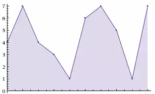
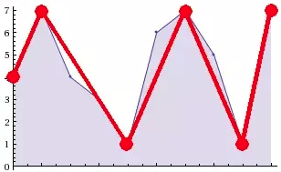

# Longest ZigZag Subsequence

### ZigZag Sequence

Sequence of numbers is called *ZigZag*, if the difference between successive numbers
strictly alternate between positive and negative. The first difference(if one exists)
may be either positive or negative. A sequence with fewer than two elements is trivially
a zig-zag sequence. It is also called *longest alternating sequence* or *longest oscillating
sequence*

Example: `{1, 7, 4, 9, 2, 5}`

### Problem

Given sequence of numbers `$X = x_1, x_2, \dots, x_n$`, find longest zigzag subsequence

`$[\color{red}{4, 7}, 4, 3, \color{red}{1}, 6, \color{red}{7}, 5, \color{red}{1, 7}]$`

---

Visualize input as a plot:



selecting elements at local extremes (i.e. peaks and crusts), gives longest zigzag subsequence.



if we treat subarray that is monotonically increasing or decreasing as *run*,  
then length of longest zigzag subsequence = number of sequential runs + 1

```java
int[] lzs(int x[]) {
    int lzs = [];
    for(int v: x) {
        if(lzs.isEmpty())
            lzs.append(v);
        else if(lzs[-1]!=v) {
            if(lzs.size()==1)
                lzs.append(v);
            else if((v-lzs[-1])*(lzs[-1]-lzs[-2]) < 0)
                lzs.append(v);
            else
                lzs[-1] = v;
        }
    }
    return lzs;
}
```

Running Time: `$O(n)$`

:bulb: this can be also solved by [Dynamic Programming](../dynamic_programming/lzs.md)

---

### References

* <https://www.quora.com/Is-it-possible-to-compute-longest-alternating-subsequence-of-a-sequence-O-n-time-If-so-how>
* <https://algnotes.wordpress.com/2013/10/18/longest-alternating-subsequence/>
