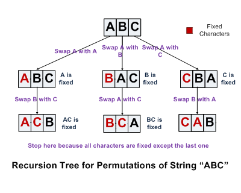

# Print Permutations



```java
void permute(char arr[]) {
    if(arr.length>1)
        permute(arr, 0, arr.length-1);
}

void permute(char arr[], int start, int end) {
    if(start==end)
        println(arr);
    for(int fix=start; fix<=end; fix++) {
        if(!isDuplicate(arr, start, fix)) {
            swap(arr, start, fix);
            permute(arr, start+1, end);
            swap(arr, start, fix); //backtrack
        }
    }
}

boolean isDuplicate(char arr[], int start, int fix) {
    while(start<fix) {
        if(arr[start]==arr[fix]) // same char is fixed already
            return true;
        start++;
    }
    return false;
}
```

### References

* <http://www.geeksforgeeks.org/write-a-c-program-to-print-all-permutations-of-a-given-string/>
