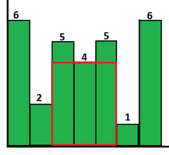
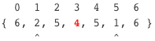

# Largest Rectangle Area in Histogram

<http://www.geeksforgeeks.org/largest-rectangular-area-in-a-histogram-set-1/>  
<http://www.geeksforgeeks.org/largest-rectangle-under-histogram/>

In given histogram, find largest rectangle area formed by contiguous bars ?  
All bars has width 1 unit.

`hist[] = { 6, 2, 5, 4, 5, 1, 6 }`

  
Max Area = `3*4` = `12` (shown in red)

## Logic

For every bar `x`, find largest rectangle formed with `x` as smallest bar in that rectangle. Then maximum of all such areas gives answer.

**How to find area with `x` as smallest bar?**




* find first smallest bar on left of `x`. leftIndex = 1
* find first smallest bar on right of `x`. rightIndex = 5
* then no of bars in rectangle = rightIndex-leftIndex-1 = 3
* so area = 3\*4 = 12

::: note
add bar of size `-1` on both ends, to get the logic work for first and last bar
:::

**How to find leftIndex and rightIndex of each bar efficiently ?**

Use stack

* scan histogram from left to right and push them(indexes) into stack
    * before pushing, pop bars that are larger than that
        * when a bar is popped, its
            * rightIndex = currentIndex
            * leftIndex   = top index in stack (-1 if empty)
      
```java
int maxArea(int hist[n]) {
    int maxArea = 0;
    Stack stack;
    for(int i=0; i<=n; i++) {
        while(!stack.isEmpty() && (i==n || hist[stack.peek()]>hist[i])) {
            int minBar = hist[stack.pop()];
            int leftIndex = stack.isEmpty() ? -1 : stack.peek();
            int area = minBar*(i-leftIndex-1);
            if(area>maxArea)
                maxArea = area;
        }
        stack.push(i);
    }
	return maxArea;
}
```

`@src(src/LargestRectangleInHistogram.java)`

Running Time: $O(n)$

---

## Largest rectangle with `1`s in binary matrix

<http://www.geeksforgeeks.org/maximum-size-rectangle-binary-sub-matrix-1s/>

Given a binary matrix, find the largest rectangle with all `1`s

$\begin{matrix}
0 & 1 & 1 & 0 \\
\color{red}1 & \color{red}1 & \color{red}1 & \color{red}1 \\
\color{red}1 & \color{red}1 & \color{red}1 & \color{red}1 \\
1 & 1 & 0 & 0
\end{matrix}$

notice how previous problem `hist[] = { 6, 2, 5, 4, 5, 1, 6 }` can be visualized as binary matrix:

```bash
      1 0 0 0 0 0 1
      1 0 1 0 1 0 1
      1 0 1 1 1 0 1
      1 0 1 1 1 0 1
      1 1 1 1 1 0 1
      1 1 1 1 1 1 1
      -------------
sums: 6 2 5 4 5 1 6
```

we can transform each row into a histogram, by counting `1`s from current row upwards until we reach `0`

```java
int maxArea(int m[r][c]) {
	int hist[c];
    
    for(int j=0; j<c; j++)
        hist[j] = m[0][j];
    int ans = maxArea(hist);

    for(int i=1; i<r; i++) {
        for(int j=0; j<c; j++)
            hist[j] = m[i][j]==1 ? hist[j]+1 : 0;
        ans = max(ans, maxArea(hist)); 
    }

    return ans;
}
``` 

`@src(src/LargestRectangleInBinaryMatrix.java)`

Running Time: $O(rc)$
