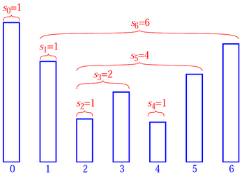

# Stock Span Problem

A stock is represented as a series of n daily price quotes.  
the span of the stock's price on a given day = maximum number of consecutive days just before the given day, for which the price of the stock on the current day is less than or equal to its price on the given day.



Mathematically, given `price[]`

if `span[i] = k`, then
* for `j=i-k to i`, `price[j] < price[i]`
* `price[i-k-1] > price[i]`

NOTE: if `price[i-1] > price[i]` then `span[i] = 0`

---

scan array from left to right, and push them(indexes) into stack  
before pushing, pop values that are smaller than current

before pushing (i.e after all pops)  
* span of current index = currentIndex-peekIndex

```java
int[] computeSpan(int price[]){
    int span[price.length];
    Stack stack;
    for(int i=0; i<price.length; i++){
        while(!stack.isEmpty() && price[stack.peek()]<price[i])
            stack.pop();
        int peekIndex = stack.isEmpty() ? -1 : stack.peek();
        span[i] = i-peekIndex;
        stack.push(i);
    }

    return span;
}
```

Running Time: `$O(n)$`

### References

* <http://www.geeksforgeeks.org/the-stock-span-problem/>
