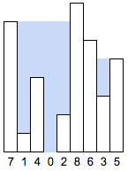
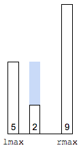
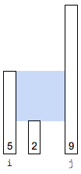
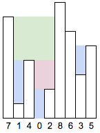

# Trapping Rain Water

Given n non-negative integers representing an elevation map
where the width of each bar is 1, compute how much water it
is able to trap after raining.



---

A bar retains water on it, if there are highter bars on left and right.

$lmax[i]$ = highest bar on left of $i^{th}$ bar  
$rmax[i]$ = highest bar on right of $i^{th}$ bar

water on $i^{th}$ bar = $min(lmax[i], rmax(i)) - bar[i]$



adding amount of water on each bar, gives the answer.

```java
int findWater(int bar[n]) {
    int water = 0;
    for(int i=0; i<n; i++) {
        int lmax = 0;
        for(int j=0; j<=i; j++)
            lmax = max(lmax, bar[j]);

        int rmax = 0;
        for(int j=i; j<n; j++)
            rmax = max(rmax, bar[j]);

        water += min(lmax, rmax) - bar[i];
    }
    return water;
}
```

`@src(src/TrappingRainWaterV1.java)`

Time Complexity: $O(n^2)$ (for each bar, we iterate the left and right parts)  
Space Complexity: $O(1)$

---

lmax and rmax for each bar can be computed in $O(n)$ time

```java
int findWater(int bar[n]) {
    if(n==0)
        return 0;

    int lmax[n];
    lmax[0] = bar[0];
    for(int i=1; i<n; i++)
        lmax[i] = max(lmax[i-1], bar[i]);

    int rmax[n];
    rmax[n-1] = bar[n-1];
    for(int i=n-2; i>=0; i--)
        rmax[i] = max(rmax[i+1], bar[i]);

    int water = 0;
    for(int i=0; i<n; i++)
        water += min(lmax[i], rmax[i]) - bar[i];
    return water;
}
```

`@src(src/TrappingRainWaterV2.java)`

Time Complexity: $O(n)$ (3 iterations)  
Space Complexity: $O(n)$

---

the water height between the bars `2.....9` will be `min(2, 9)`, 
irrespective of height of bars between them.

traverse from either end of array, until they meet.  
move the end with smaller bar.  
while doing this update lmax and rmax appropriately.

```java
int findWater(int bar[]) {
    int water = 0;
    int left = 0, right = bar.length-1;
    int lmax = 0, rmax = 0;
    while(left<right) {
        if(bar[left]<bar[right]) { // 2...9
            if(bar[left]>lmax)
                lmax = bar[left]; // water spills to left
            else {
                // for bar[left], we know lmax. but we don't know exact value of rmax
                // but we are sure that it is greater than lmax
                // so min(lmax, rmax) evaluates to lmax
                water += lmax - bar[left];
            }
            left++;
        } else { // 9..2
            if(bar[right]>rmax)
                rmax = bar[right]; // water spills to right
            else {
                // for bar[right], we know rmax. but we don't know exact value of lmax
                // but we are sure that it is greater than rmax
                // so min(lmax, rmax) evaluates to rmax
                water += rmax - bar[right];
            }
            right--;
        }
    }
    return water;
}
```

`@src(src/TrappingRainWaterV3.java)`

Time Complexity: $O(n)$ (1 iteration)  
Space Complexity: $O(1)$

---

a bar retains water above it, when it is bounded by longer bars on either side.  



water width = `j - i - 1`  
water height = `min(5, 9) - 2`  
water bounded by middle bar = `width * height`

we can use stack to keep track of the nearest longest bars.



```java
int findWater(int bar[n]) {
    int water = 0;
    Stack stack = new Stack();
    for(int i=0; i<n; i++) {
        while(!stack.isEmpty() && bar[i]>bar[stack.peek()]) {
            int cur = stack.pop();
            if(!stack.isEmpty()) {
                // compute water bounded by bar[cur]
                int width = i - stack.peek() - 1;
                int height = min(bar[stack.peek()], bar[i]) - bar[cur]; 
                water += width * height;
            }
        }
        stack.push(i);
    }
    return water;
}
```

`@src(src/TrappingRainWaterV4.java)`

Time Complexity: $O(n)$ (each bar is pushed and popped once)  
Space Complexity: $O(n)$ (in case of stars-like or flat bars)

---

### References

* <http://www.geeksforgeeks.org/trapping-rain-water/>
* <https://leetcode.com/problems/trapping-rain-water/solution/>
