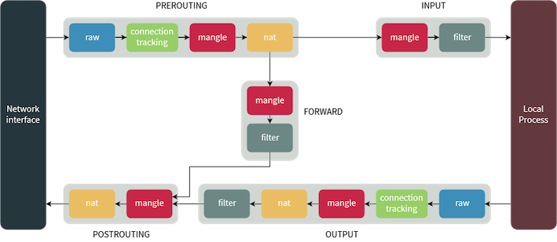

# iptables

command line interface to packet filtering functionality in netfilter

organized into 3 structures:
* tables
* chains
* targets

tables allow you to process packets in specific ways. tables have chains associted with them
chains allow you to inspect packets at various points, and associate it with a target. a target
decides fate of packet such as allowing and rejecting it.

---
## tables

there are 4 tables

* filter
    * default and most widely used
    * decides what packets should be allowed to reach destination
* mangle
    * to alter packet headers, ex: ttl values
* nat
    * to route packets to different networks on NAT networks
    * changes source and destination address of packets
    * used to allow access to services that can't be accessed directly, because they are on NAT network
* raw
    * stateful firewall. i.e, packets are inspected with respected to their state
    * packets might be part of new connection or existing connection

---
## chains

* PREROUTING
    * apply to packets as they just arrive on network interface
    * present in nat, mangle and raw tables
* INPUT
    * apply to packets just before they are given to a local process
    * present in mangle and filter tables
* OUTPUT
    * apply to packets just after they are produced by a process
    * present in raw, mangle, nat and filter tables
* FORWARD
    * apply to any packets that are routed through current host
    * present in mangle and filter tables
* POSTROUTING
    * apply to packets as they just leave the network interface
    * present nat and mangle tables



---

## targets

* decide fate of a packet
* could be terminating, means fate decided immediately
    * ACCEPT: accept the packet
    * DROP: for clients, it would appear like your system didn't even exist
    * REJECT: rejects packet
        * sends `connection reset` for TCP
        * sends `destination host unreachable` for UDP, ICMP
* could be non-terminating, such as LOG target

---

`-L` list all rules  
`--line-numbers` number the rules  
`-n` dont do reverse dns lookups on ips  
`-t <table>` if ommitted defaults to `filter`  
`-v` verbose output

`-A <chain>` append to chain  
`-D <chain> <num|rule>` delete from chain  
`-I <chain> [num] <rule>` insert into chain. num defaults to 1  
`-F <chain>` flush/removeall in chain  
`-R <chain> <num> <rule>` replace in chain

`-s <source-address>` and `-d <destination-address>` address can be:
* `59.45.175.62` just ip
* `59.45.175.0/24` cidr notation
* `10.10.10.0/255.255.255.0` cidr notation

`-i <input-interface>` used in INPUT chain  
`-o <output-interface>` used in OUTPUT chain

`-j <target>` jump target  
`-p <tcp|udp|icmp>` protocol

```shell
$ # to change default policy
$ iptables -P INPUT DROP

$ # to negate a condition use !
$ iptables -A INPUT -p tcp -m multiport ! --dports 22,80,443 -j DROP
```

---

## `man iptables-extensions`

`-m <module>` each module has additional matching options

`-m tcp`
* `--sport` or `--source-port`
* `--dport` or `--destination-port`

`-m state` or `-m conntract`
* states tracked
    * `NEW`: very first packet of a connection
    * `ESTABLISHED`: packets part of existing connection and connection should have received a reply from host
    * `RELATED`: connections that are related to another ESTABLISHED connection. ex: FTP data connection, which is releated to already established control connection
    * `INVALID`: packets with no proper state possible because of low memory
    * `UNTRACKED`: packets exempted from connection tracking in raw table with NOTRACK target end up in this state
    * `DNAT`: virtual state of packets whose destination address was changed by rules in nat table
    * `SNAT`: virtual state of packets whose source address was changed by rules in nat table
* `--ctstate <states>` or `--state <states>` 

---

## Save and Restore

```shell
$ iptables-save > rules
$ iptables-restore < rules

$ # to preserve on reboot
$ apt-get install iptables-persistent
$ yum install iptables-services
$ iptables-save > /etc/iptables/rules.v4
$ ip6tables-save > /etc/iptables/rules.v6
```

---
### References

* <https://www.booleanworld.com/depth-guide-iptables-linux-firewall/>
* <https://linuxconfig.org/how-to-make-iptables-rules-persistent-after-reboot-on-linux>
