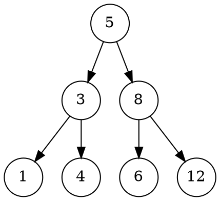

# Markdown

Following are some extensions to standard markdown, that can be used in notes

---

### [Emojis](https://emoji.codes/)

    this is a :smile: smile emoji

this is a :smile: smile emoji

---

### [FontAwesome](http://fontawesome.io)

    click :fa-refresh: to refresh the page.  
    to enable autorefresh after every 5 seconds click :fa-refresh,fa-spin,fa-fw:

click :fa-refresh: to refresh the page.
to enable autorefresh after every 5 seconds click :fa-refresh,fa-spin:

---

### [Font Mfizz](http://fizzed.com/oss/font-mfizz)

    :icon-go: :icon-java: :icon-ruby: :icon-apache:

:icon-go: :icon-java: :icon-ruby: :icon-apache:

---

### Containers

```
::: tip
this is tip
:::

::: warning
this is warning
:::

::: note
this is note
:::
```
::: tip
this is tip
:::
::: warning
this is warning
:::
::: note
this is note
:::

---

### Tex

wrap TeX in `$` or `$$` delimiters

```
When $a \ne 0$, there are two solutions to $ax^2 + bx + c = 0$ and they are
$$x = {-b \pm \sqrt{b^2-4ac} \over 2a}$$
```

When $a \ne 0$, there are two solutions to $ax^2 + bx + c = 0$ and they are
$$x = {-b \pm \sqrt{b^2-4ac} \over 2a}$$
          
---

### [Graphviz](http://www.graphviz.org/download/)

    ```graphviz
    digraph G {
      node [shape=circle, fixedsize=true];
      5 -> 3;
      5 -> 8;
      3 -> 1;
      3 -> 4;
      8 -> 6;
      8 -> 12;
    }
    ```


